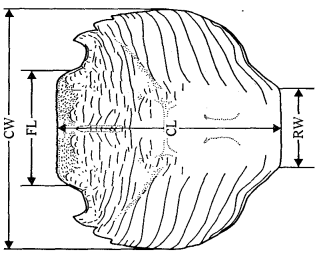
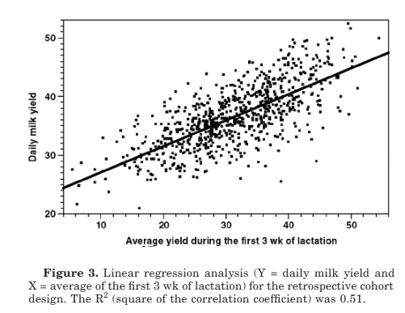
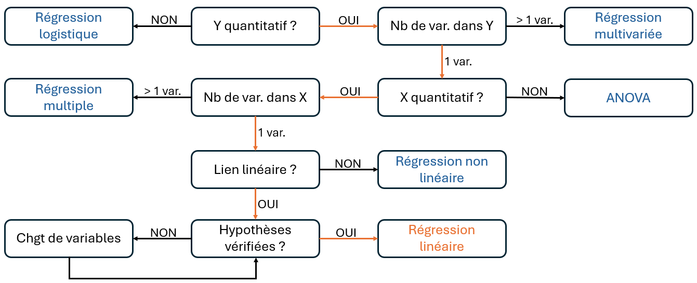

```{r setup}

library(ggplot2)
library(plotly)
library(dplyr)
library(msos)
library(patchwork)
```

## 🔍 Introduction : Un modèle linéaire, qu'est-ce c'est ? {data-visibility="uncounted"}

```{=html}
<div style="height:5px;"></div>
```

> Un [modèle linéaire]{.smallcaps} cherche à expliquer une variable $Y$ à partir d’une ou plusieurs variables explicatives $X$, en supposant qu’il existe une relation linéaire entre elles, représentée par une droite.

. . .

| Questions de recherche | $X$ = variable(s) explicative(s) | $Y$ = variable expliquée |
|------------------------|------------------------|------------------------|
| Peut-on [prédire]{.smallcaps} le prix d'un appartement en fonction de sa superficie ? | Superficie | Prix |
| La production de lait d'une vache au cours des 3 premières semaines de lactation permet-elle d'[expliquer]{.smallcaps} la production moyenne de lait sur l'ensemble de la période de lactation ? | Production moyenne semaines 1 à 3 | Production moyenne sur toute la lactation (par semaine) |
| La taille et le poids [varient]{.smallcaps}-ils avec l'âge ? | Taille/Poids | Âge |
| Le type d'alimentation (granules, foin, ...) est-il [lié]{.smallcaps} à la vitesse de croissance de l'animal ? | Type d'alimentation | Vitesse de croissance |

. . .

::: callout-warning
Un modèle linéaire décrit un [lien linéaire]{.smallcaps} entre des variables et **non** un effet/une causalité.
:::

## 🔍 Introduction : Un modèle linéaire, qu'est-ce c'est ? {data-visibility="uncounted"}

```{=html}
<div style="height:5px;"></div>
```

> Un [modèle linéaire]{.smallcaps} cherche à expliquer une variable $Y$ à partir d’une ou plusieurs variables explicatives $X$, en supposant qu’il existe une relation linéaire entre elles, représentée par une droite.

::: {#tableau-focus}
| Questions de recherche | $X$ = variable(s) explicative(s) | $Y$ = variable expliquée |
|------------------------|------------------------|------------------------|
| Peut-on [prédire]{.smallcaps} le prix d'un appartement en fonction de sa superficie ? | Superficie | Prix |
| La production de lait d'une vache au cours des 3 premières semaines de lactation permet-elle d'[expliquer]{.smallcaps} la production moyenne de lait sur l'ensemble de la période de lactation ? | Production moyenne semaines 1 à 3 | Production moyenne sur toute la lactation (par semaine) |
| La taille et le poids [varient]{.smallcaps}-ils avec l'âge ? | Taille/Poids | Âge |
| Le type d'alimentation (granules, foin, ...) est-il [lié]{.smallcaps} à la vitesse de croissance de l'animal ? | Type d'alimentation | Vitesse de croissance |
:::

. . .

::: small-box
Dans ce cours, on va se concentrer sur la [régression linéaire simple]{.smallcaps} :

**1 variable explicative** $X$ et **1 variable à expliquer** $Y$.
:::

## 🦀 Application : Présentation des données

```{=html}
<div style="height:5px;"></div>
```

[[Jeu de données utilisé :]{.underline}]{.smallcaps} Mesures morphologiques chez les crabes *Leptograpsus variegatus*, collectés à Fremantle en Australie [@campbell1974].

:::::: columns
::: {.column width="60%"}
<br>

-   200 crabes étudiés (50 $\times$ 2 sexes $\times$ 2 couleurs)
-   5 mesures morphologiques

{fig-align="center"}
:::

:::: {.column width="40%"}
::: columns
```{r}
#| echo: false
#| message: false
#| warning: false

knitr::kable(head(crabs, 10))
```
:::
::::
::::::

## 🦀 Application : Question de recherche

:::: center-text
::: highlight-box
**Y a-t-il un lien [linéaire]{.smallcaps} entre la longueur de la carapace (CL) et celle du lobe frontal (FL) ?**
:::
::::

## 📖 Objectifs du cours

```{=html}
<br>
<br>
<div style="height:5px;"></div>
```

1.  Comment construire un modèle linéaire ? (Exemple & Définition)

```{=html}
<div style="height:5px;"></div>
```

2.  Comment trouver la droite qui décrit le mieux les données ? (Méthode des moindres carrés)

```{=html}
<div style="height:5px;"></div>
```

3.  Comment savoir si cette droite est de bonne qualité ? (Coefficient de détermination R²)

```{=html}
<div style="height:5px;"></div>
```

4.  Application aux données de crabe

```{=html}
<div style="height:5px;"></div>
```

5.  Conclusion & Exemples concrets de contributions scientifiques

## 1️⃣ Écriture du modèle : Définition

```{=html}
<div style="height:10px;"></div>
```

::::::: columns
::: {.column width="65%"}

[[Définition : Modèle linéaire]{.underline}]{.smallcaps}

:   Considérons un individu $i$ et deux variables mesurées sur cet individu : $Y_i$ la *variable à expliquer* et $X_i$ la *variable explicative*. Le [modèle linéaire]{.smallcaps} décrit la relation (linéaire) entre $Y_i$ et $X_i$ sous la forme :

    $$
    Y_i = \color{#CC79A7}{\beta_0} + \color{#009E73}{\beta_1}X_i + \epsilon_i
    $$

    où $\color{#CC79A7}{\beta_0}$ est l'ordonnée à l'origine, $\color{#009E73}{\beta_1}$ le coefficient directeur et $\epsilon$ un bruit (aléatoire).
:::

::::: {.column width="30%"}
:::: {style="border: 2px solid #D9E1F2;   border-radius: 25px;   padding: 0;   margin: 20px 0px 0px 50px;   background: transparent;   box-shadow: 0 2px 8px rgba(100,120,150,0.10);   overflow: hidden;"}
::: {.text-center style="text-align: center;   font-size: 0.75em;"}
[[équation d'une droite :]{.underline}]{.smallcaps}

$$
y = \color{#009E73}{a} \times x + \color{#CC79A7}{b}
$$

```{r}
#| label: eq_courbe
#| echo: false
#| message: false
#| warning: false
#| fig-height: 7
#| fig-width: 10


# Paramètres de la droite
a <- 1.25
b <- 0.75

# Droite
x <- seq(-1, 5, length.out = 100)
df <- data.frame(
  x = x,
  y = a * x + b
)

# Points utilisés pour illustrer le coefficient directeur
x1 <- 1
x2 <- 2
y1 <- a * x1 + b
y2 <- a * x2 + b

ggplot(df, aes(x, y)) +

  # Droite
  geom_line(
    color = "#E69F00",
    linewidth = 3.5
  ) +

  # Point correspondant à l'ordonnée à l'origine
  annotate(
    "point",
    x = 0, y = b,
    size = 13,
    color = "#CC79A7"
  ) +

  # Triangle : Δx
  annotate(
    "segment",
    x = x1, xend = x2,
    y = y1, yend = y1,
    linewidth = 3.5,
    color = "#009E73"
  ) +

  # Triangle : Δy
  annotate(
    "segment",
    x = x2, xend = x2,
    y = y1, yend = y2,
    linewidth = 3.5,
    color = "#009E73"
  ) +

  # Δx
  annotate(
    "text",
    x = (x1 + x2) / 2,
    y = y1 - 0.3,
    label = expression(Delta*x),
    color = "#009E73",
    fontface = "bold",
    size = 8
  ) +

  # Δy
  annotate(
    "text",
    x = x2 + 0.45,
    y = (y1 + y2) / 2,
    label = expression(Delta*y),
    color = "#009E73",
    fontface = "bold",
    size = 8
  ) +

  # b : ordonnée à l'origine
  annotate(
    "label",
    x = 1.95,
    y = 4.0,
    label = "Ordonnée à l'origine b",
    color = "#CC79A7",
    size = 12
  ) +

  # Flèche vers b
  annotate(
    "segment",
    x = 1.95, xend = 0.2,
    y = 3.6, yend = 1.1,
    color = "#CC79A7",
    linewidth = 2.8,
    arrow = arrow(length = unit(0.5, "cm"))
  ) +

  # a : coefficient directeur
  annotate(
    "label",
    x = 2.7,
    y = 0.5,
    label = "Coefficient directeur a = Δy/Δx",
    color = "#009E73",
    size = 12
  ) +

  # Flèche vers le triangle
  annotate(
    "segment",
    x = 2.7, xend = 2.1,
    y = 1, yend = 1.9,
    color = "#009E73",
    linewidth = 2.8,
    arrow = arrow(length = unit(0.5, "cm"))
  ) +

  # Axe x avec flèche
  annotate(
    "segment",
    x = -1, xend = 5,
    y = 0, yend = 0,
    linewidth = 2.6,
    arrow = arrow(length = unit(0.5, "cm"))
  ) +

  # Axe y avec flèche
  annotate(
    "segment",
    x = 0, xend = 0,
    y = -1, yend = 5,
    linewidth = 2.6,
    arrow = arrow(length = unit(0.5, "cm"))
  ) +

  # x
  annotate(
    "text",
    x = 4.8, y = -0.3,
    label = "x",
    fontface = "italic",
    size = 11
  ) +

  # y
  annotate(
    "text",
    x = -0.3, y = 4.8,
    label = "y",
    fontface = "italic",
    size = 11
  ) +

  # Limites
  coord_cartesian(
    xlim = c(-1, 5.1),
    ylim = c(-1, 5.1),
    expand = FALSE
  ) +

  # Graduations
  scale_x_continuous(
    breaks = -1:5
  ) +

  scale_y_continuous(
    breaks = -1:5
  ) +

  # Thème
  theme_minimal(base_size = 31) +

  theme(
    panel.grid.major = element_line(
      color = "#D9E1F2",
      linewidth = 1,
      linetype = "dashed"
    ),
    panel.grid.minor = element_line(
      color = "#E9EEF5",
      linewidth = 0.7,
      linetype = "dashed"
    ),
    axis.title = element_blank(),
    axis.text = element_text(
      color = "#333333",
      size = 23
    ),
    plot.margin = margin(30, 35, 30, 30)
  )
```
:::
::::
:::::
:::::::

. . .

::: callout-note
La [régression linéaire]{.smallcaps} désigne l'estimation de paramètres $\color{#CC79A7}{\beta_0}$ et $\color{#009E73}{\beta_1}$ à partir des données observées.
:::

## 1️⃣ Écriture du modèle : Exemple

```{=html}
<div style="height:5px;"></div>
```

::: {.small-box style="text-align"}
$Y_i$ = Longueur de la carapace (CL) – $X_i$ = Longueur du lobe frontal (FL)
:::

::::: columns
::: {.column width="50%"}
<br>

<br>

<br>

$$
Y_i = \color{#CC79A7}{\beta_0} + \color{#009E73}{\beta_1}X_i + \epsilon_i
$$
:::

::: {.column width="50%"}
```{r}
#| label: plot_crab
#| echo: false
#| message: false
#| warning: false
#| fig-width: 6
#| fig-height: 5


p <- plot_ly() %>%
  add_trace(
    data = crabs,
    x = ~FL,
    y = ~CL,
    type = "scatter",
    mode = "markers",
    text = ~paste(
      "<b>Individu :", row.names(crabs), "</b>",
      "<br>FL :", FL,
      "<br>CL :", CL
    ),
    hoverinfo = "text",
    marker = list(
      size = 6,
      color = "#0072B2"
    )
  ) %>%
  layout(
    xaxis = list(
      title = "X = Longueur du lobe frontal (FL)",
      titlefont = list(size = 20),
      tickfont = list(size = 17)
    ),
    yaxis = list(
      title = "Y = Longueur de la carapace (CL)",
      titlefont = list(size = 20),
      tickfont = list(size = 17)
    ),
    showlegend = FALSE,
    uirevision = "zoom",
    newshape = list(
      line = list(
        color = "#E69F00",
        width = 4
      )
    )
  )

p %>%
  config(
    modeBarButtonsToAdd = c(
      "drawline",
      "drawopenpath",
      "eraseshape"
    )) %>%
  layout(
    xaxis = list(
      fixedrange = TRUE
    ),
    yaxis = list(
      fixedrange = TRUE
    )
  )

```
:::
:::::

## 1️⃣ Les hypothèses du modèle (à vérifier bien sûr 😉)

```{=html}
<div style="height:10px;"></div>
```

1.  [[indépendance :]{.underline}]{.smallcaps} Les $\epsilon_i$ sont indépendants $\longrightarrow$ Les $Y_i$ sont indépendants

|  |
|:----------------------------------------------------------------------:|
| La mesure prise sur un individu n'a pas d'influence sur celle prise sur un autre. |

```{=html}
<div style="height:40px;"></div>
```

2.  [[linéarité :]{.underline}]{.smallcaps} $\mathbf{E}(\epsilon) = 0$ $\longrightarrow$ à $x$ fixé, $\mathbf{E}(Y) = \beta_0 + \beta_1 x$

::::: columns
::: {.column width="50%"}
```{r}
#| echo: false
#| message: false
#| warning: false

set.seed(123)

# -------------------------
# Points classiques
# -------------------------
n_classic <- 140

data_classic <- data.frame(
  X = c(
    runif(n_classic / 2, 2, 5.75),
    runif(n_classic / 2, 6.25, 8)
  )
)

data_classic$Y <- 2 + 1.2 * data_classic$X +
  rnorm(n_classic, 0, 1.0)


# -------------------------
# Points à X = 6
# -------------------------
n <- 30

data_lin <- data.frame(
  X = rep(6, n)
)

# Erreurs symétriques → moyenne exactement 9.2
eps <- rnorm(n / 2, 0, 2.8)
eps <- c(eps, -eps)

data_lin$Y <- 2 + 1.2 * data_lin$X + eps

# Jitter horizontal uniquement pour l'affichage
data_lin$X_plot <- data_lin$X +
  runif(n, -0.25, 0.25)

mean_x6 <- mean(data_lin$Y)


# -------------------------
# Graphique
# -------------------------
ggplot() +

  # Ligne verticale : X fixé à 6
  geom_vline(
    xintercept = 6,
    linetype = "dashed",
    linewidth = 1.2,
    color = "black"
  ) +

  # Points classiques
  geom_point(
    data = data_classic,
    aes(X, Y),
    color = "#9ECAE1",
    alpha = 0.65,
    size = 5
  ) +

  # Points à X = 6
  geom_point(
    data = data_lin,
    aes(X_plot, Y),
    color = "#2171B5",
    size = 5.5
  ) +

  # Droite de moyenne
  geom_abline(
    intercept = 2,
    slope = 1.2,
    color = "#E69F00",
    linewidth = 2
  ) +

  # Moyenne à X = 6
  geom_point(
    aes(x = 6, y = mean_x6),
    color = "black",
    shape = 4,
    size = 11,
    stroke = 3
  ) +

  # Annotation
  annotate(
    "text",
    x = 6.26,
    y = mean_x6 - 1.25,
    label = expression(bar(y) ~ "à" ~ x ~ "fixé"),
    hjust = 0,
    size = 12
  ) +

  coord_cartesian(xlim = c(2, 8)) +

  labs(
    title = "Cas linéaire",
    x = "X",
    y = "Y"
  ) +

  theme_minimal(base_size = 20) +

  theme(
    plot.title = element_text(
      size = 28,
      face = "bold",
      hjust = 0.5
    ),
    axis.title = element_text(size = 24),
    axis.text = element_text(size = 20)
  )
```
:::

::: {.column width="50%"}
```{r}
#| echo: false
#| message: false
#| warning: false

set.seed(123)

# -------------------------
# Points classiques
# -------------------------
n_classic <- 140

data_classic <- data.frame(
  X = c(
    runif(n_classic / 2, 2, 5.75),
    runif(n_classic / 2, 6.25, 8)
  )
)

# Relation très non linéaire
data_classic$Y <- 2 * data_classic$X^2 -
  20 * data_classic$X + 58 +
  rnorm(n_classic, 0, 1.5)


# -------------------------
# Points à X = 6
# -------------------------
n <- 30

data_lin <- data.frame(
  X = rep(6, n)
)

# Grande dispersion verticale
# Erreurs symétriques → moyenne exactement sur la courbe
eps <- rnorm(n / 2, 0, 4.0)
eps <- c(eps, -eps)

data_lin$Y <- 2 * data_lin$X^2 -
  20 * data_lin$X + 58 + eps

# Jitter horizontal uniquement pour l'affichage
data_lin$X_plot <- data_lin$X +
  runif(n, -0.25, 0.25)

mean_x6 <- mean(data_lin$Y)


# -------------------------
# Régression linéaire
# -------------------------
data_reg <- rbind(
  data_classic[, c("X", "Y")],
  data_lin[, c("X", "Y")]
)

mod <- lm(Y ~ X, data = data_reg)


# -------------------------
# Graphique
# -------------------------
ggplot() +

  # X fixé à 6
  geom_vline(
    xintercept = 6,
    linetype = "dashed",
    linewidth = 1.2,
    color = "black"
  ) +

  # Points classiques
  geom_point(
    data = data_classic,
    aes(X, Y),
    color = "#9ECAE1",
    alpha = 0.65,
    size = 5
  ) +

  # Points à X = 6
  geom_point(
    data = data_lin,
    aes(X_plot, Y),
    color = "#2171B5",
    size = 5.5
  ) +

  # Régression linéaire classique
  geom_abline(
    intercept = coef(mod)[1],
    slope = coef(mod)[2],
    color = "#E69F00",
    linewidth = 2,
    linetype = "solid"
  ) +

  # Vraie relation moyenne non linéaire
  stat_function(
    fun = function(x) 2 * x^2 - 20 * x + 58,
    color = "#D55E00",
    linewidth = 2.2,
    linetype = "dashed"
  ) +

  # Moyenne à X = 6
  geom_point(
    aes(x = 6, y = mean_x6),
    color = "black",
    shape = 4,
    size = 11,
    stroke = 3
  ) +

  # Annotation
  annotate(
    "text",
    x = 6.26,
    y = mean_x6 - 1.5,
    label = expression(bar(y) ~ "à" ~ x ~ "fixé"),
    hjust = 0,
    size = 12
  ) +

  coord_cartesian(xlim = c(2, 8)) +

  labs(
    title = "Cas non linéaire",
    x = "X",
    y = "Y"
  ) +

  theme_minimal(base_size = 20) +

  theme(
    plot.title = element_text(
      size = 28,
      face = "bold",
      hjust = 0.5
    ),
    axis.title = element_text(size = 24),
    axis.text = element_text(size = 20)
  )
```
:::
:::::

|  |
|:----------------------------------------------------------------------:|
| A $x$ fixé, les points observés $y$ sont "groupés" autour de la droite $\beta_0 + \beta_1x$. |

## 1️⃣ Les hypothèses du modèle (à vérifier bien sûr 😉)

<br>

3.  [[normalité des résidus :]{.underline}]{.smallcaps} $\epsilon \sim \mathcal{N}(0, \sigma^2)$ $\longrightarrow$ à $x$ fixé, $Y \sim \mathcal{N}(\beta_0 + \beta_1x, \sigma^2)$

::::: columns
::: {.column width="50%"}
```{r}
#| echo: false
#| message: false
#| warning: false

set.seed(123)

# -------------------------
# Points classiques
# -------------------------
n_classic <- 60

data_classic <- data.frame(
  X = c(
    runif(n_classic / 2, 2, 5.75),
    runif(n_classic / 2, 6.25, 8)
  )
)

data_classic$Y <- 2 + 1.2 * data_classic$X +
  rnorm(n_classic, 0, 1.0)


# -------------------------
# Points à X = 6
# -------------------------
n <- 30

data_lin <- data.frame(
  X = rep(6, n)
)

# Erreurs normales
eps <- rnorm(n / 2, 0, 2.8)
eps <- c(eps, -eps)

data_lin$Y <- 2 + 1.2 * data_lin$X + eps

# Jitter horizontal uniquement pour l'affichage
data_lin$X_plot <- data_lin$X +
  runif(n, -0.25, 0.25)

mean_x6 <- mean(data_lin$Y)


# -------------------------
# Densité normale verticale
# -------------------------

mu_x6 <- 2 + 1.2 * 6
sigma <- 2.8

y_grid <- seq(
  mu_x6 - 4 * sigma,
  mu_x6 + 4 * sigma,
  length.out = 300
)

dens <- dnorm(
  y_grid,
  mean = mu_x6,
  sd = sigma
)

# Largeur de la cloche
dens_scaled <- dens / max(dens) * 0.65

normal_curve <- data.frame(
  X = 6 - dens_scaled,
  Y = y_grid
)


# -------------------------
# Graphique
# -------------------------

ggplot() +

  # Ligne verticale : X fixé à 6
  geom_vline(
    xintercept = 6,
    linetype = "dashed",
    linewidth = 1.2,
    color = "black"
  ) +

  # Points classiques
  geom_point(
    data = data_classic,
    aes(X, Y),
    color = "#9ECAE1",
    alpha = 0.65,
    size = 5
  ) +

  # Points à X = 6
  geom_point(
    data = data_lin,
    aes(X_plot, Y),
    color = "#2171B5",
    size = 5.5
  ) +

  # Droite de régression / moyenne
  geom_abline(
    intercept = 2,
    slope = 1.2,
    color = "#E69F00",
    linewidth = 2
  ) +

  # Courbe normale verticale
  geom_path(
    data = normal_curve,
    aes(X, Y),
    linewidth = 1.5
  ) +

  coord_cartesian(
    xlim = c(2, 8)
  ) +

  labs(
    title = "Cas normal",
    x = "X",
    y = "Y"
  ) +

  theme_minimal(base_size = 20) +

  theme(
    plot.title = element_text(
      size = 28,
      face = "bold",
      hjust = 0.5
    ),
    axis.title = element_text(size = 24),
    axis.text = element_text(size = 20)
  )
```
:::

::: {.column width="50%"}
```{r}
#| echo: false
#| message: false
#| warning: false

set.seed(123)

# -------------------------
# Points classiques
# -------------------------
n_classic <- 60

data_classic <- data.frame(
  X = c(
    runif(n_classic / 2, 2, 5.75),
    runif(n_classic / 2, 6.25, 8)
  )
)

data_classic$Y <- 2 + 1.2 * data_classic$X +
  rnorm(n_classic, 0, 1.0)


# -------------------------
# Points à X = 6
# -------------------------
n <- 30

data_lin <- data.frame(
  X = rep(6, n)
)

# Erreurs NON normales : exponentielle centrée
# Moyenne = 0 mais distribution asymétrique
eps <- rexp(n, rate = 1 / 2.8) - 2.8

data_lin$Y <- 2 + 1.2 * data_lin$X + eps

# Jitter horizontal uniquement pour l'affichage
data_lin$X_plot <- data_lin$X +
  runif(n, -0.25, 0.25)

mean_x6 <- mean(data_lin$Y)


# -------------------------
# Densité non normale verticale
# -------------------------

mu_x6 <- 2 + 1.2 * 6

# Distribution exponentielle centrée
y_grid <- seq(
  mu_x6 - 2.8,
  mu_x6 + 4 * 2.8,
  length.out = 300
)

# Densité de l'erreur centrée
dens <- dexp(
  y_grid - mu_x6 + 2.8,
  rate = 1 / 2.8
)

# Largeur de la courbe
dens_scaled <- dens / max(dens) * 0.65

non_normal_curve <- data.frame(
  X = 6 - dens_scaled,
  Y = y_grid
)


# -------------------------
# Graphique
# -------------------------

ggplot() +

  # Ligne verticale : X fixé à 6
  geom_vline(
    xintercept = 6,
    linetype = "dashed",
    linewidth = 1.2,
    color = "black"
  ) +

  # Points classiques
  geom_point(
    data = data_classic,
    aes(X, Y),
    color = "#9ECAE1",
    alpha = 0.65,
    size = 5
  ) +

  # Points à X = 6
  geom_point(
    data = data_lin,
    aes(X_plot, Y),
    color = "#2171B5",
    size = 5.5
  ) +

  # Droite de régression / moyenne
  geom_abline(
    intercept = 2,
    slope = 1.2,
    color = "#E69F00",
    linewidth = 2
  ) +

  # Distribution non normale verticale
  geom_path(
    data = non_normal_curve,
    aes(X, Y),
    linewidth = 1.5
  ) +

  coord_cartesian(
    xlim = c(2, 8)
  ) +

  labs(
    title = "Cas non normal",
    x = "X",
    y = "Y"
  ) +

  theme_minimal(base_size = 20) +

  theme(
    plot.title = element_text(
      size = 28,
      face = "bold",
      hjust = 0.5
    ),
    axis.title = element_text(size = 24),
    axis.text = element_text(size = 20)
  )
```
:::
:::::

|  |
|:----------------------------------------------------------------------:|
| A $x$ fixé, les points observés $y$ sont distribués selon une distribution Normale centrée sur la droite. |

## 1️⃣ Les hypothèses du modèle (à vérifier bien sûr 😉)

<br>

4.  [[homoscédasticité :]{.underline}]{.smallcaps} La variance des $\epsilon_i$ est constante pour tout $i$ $\longrightarrow$ La variance des $Y_i$ est constante pour tout $i$

::::: columns
::: {.column width="50%"}
```{r}
#| echo: false
#| message: false
#| warning: false

set.seed(123)

n_x <- 15
n_rep <- 5

data <- data.frame(
  X = rep(seq(2, 8, length.out = n_x), each = n_rep)
)

# -------------------------
# Variance constante
# -------------------------

sigma <- 1.5

eps <- rnorm(nrow(data), 0, sigma)

# Même variance pour chaque X,
# mais moyenne libre
eps <- ave(
  eps,
  data$X,
  FUN = function(z) {
    z / sd(z) * sigma
  }
)

data$Y <- 2 + 1.2 * data$X + eps


# -------------------------
# Min et max observés
# pour CHAQUE valeur de X
# -------------------------

width_data <- aggregate(
  Y ~ X,
  data = data,
  FUN = function(y) c(
    min = min(y),
    max = max(y)
  )
)

width_data <- do.call(
  data.frame,
  width_data
)

names(width_data) <- c(
  "X",
  "Y_min",
  "Y_max"
)


# -------------------------
# Tracé
# -------------------------

ggplot(data, aes(X, Y)) +

  # Segment entre le minimum et le maximum
  # pour chaque X
  geom_segment(
    data = width_data,
    aes(
      x = X,
      xend = X,
      y = Y_min,
      yend = Y_max
    ),
    linetype = "dashed",
    linewidth = 1
  ) +

  # Points
  geom_point(
    color = "#2171B5",
    alpha = 0.75,
    size = 5
  ) +

  # Droite de moyenne
  geom_abline(
    intercept = 2,
    slope = 1.2,
    color = "#E69F00",
    linewidth = 2
  ) +

  coord_cartesian(
    xlim = c(2, 8)
  ) +

  labs(
    title = "Cas homoscédastique",
    x = "X",
    y = "Y"
  ) +

  theme_minimal(base_size = 20) +

  theme(
    plot.title = element_text(
      size = 28,
      face = "bold",
      hjust = 0.5
    ),
    axis.title = element_text(size = 24),
    axis.text = element_text(size = 20)
  )
```
:::

::: {.column width="50%"}
```{r}
#| echo: false
#| message: false
#| warning: false

set.seed(123)

n_x <- 15
n_rep <- 5

data <- data.frame(
  X = rep(seq(2, 8, length.out = n_x), each = n_rep)
)

sigma_x <- 0.3 + 0.8 * (data$X - 2)

data$Y <- 2 + 1.2 * data$X +
  rnorm(nrow(data), 0, sigma_x)


# Min et max observés pour chaque X
width_data <- aggregate(
  Y ~ X,
  data = data,
  FUN = function(x) c(min = min(x), max = max(x))
)

width_data <- do.call(
  data.frame,
  width_data
)

names(width_data) <- c("X", "Y_min", "Y_max")


# -------------------------
# Graphique
# -------------------------

ggplot(data, aes(X, Y)) +

  # Min-max pour chaque X
  geom_segment(
    data = width_data,
    aes(
      x = X,
      xend = X,
      y = Y_min,
      yend = Y_max
    ),
    linetype = "dashed",
    linewidth = 1
  ) +

  geom_point(
    color = "#2171B5",
    alpha = 0.75,
    size = 5
  ) +

  geom_abline(
    intercept = 2,
    slope = 1.2,
    color = "#E69F00",
    linewidth = 2
  ) +

  labs(
    title = "Cas hétéroscédastique",
    x = "X",
    y = "Y"
  ) +

  theme_minimal(base_size = 20) +

  theme(
    plot.title = element_text(
      size = 28,
      face = "bold",
      hjust = 0.5
    ),
    axis.title = element_text(size = 24),
    axis.text = element_text(size = 20)
  )
```
:::
:::::

|                                                                    |
|:------------------------------------------------------------------:|
| La dispersion des $Y$ est constante quelque soit la valeur de $X$. |

## 1️⃣ Vérification des hypothèses sur les données de crabes

```{=html}
<div style="height:5px;"></div>
```

::::: columns
::: {.column width="50%"}
```{=html}
<div style="height:40px;"></div>
```

-   [[Indépendance :]{.underline}]{.smallcaps} ✅ Chaque crabe est différent.

```{=html}
<div style="height:5px;"></div>
```

-   [[Linéarité :]{.underline}]{.smallcaps} ✅ A $x$ fixé, la moyenne des $y$ correspond à la droite.

```{=html}
<div style="height:5px;"></div>
```

-   [[Normalité :]{.underline}]{.smallcaps} ✅ A $x$ fixé, les $y$ sont normalement distribués.

```{=html}
<div style="height:5px;"></div>
```

-   [[Homoscédasticité :]{.underline}]{.smallcaps} ✅ La dispersion des $y$ est constante.
:::

::: {.column width="50%"}
```{r}
#| echo: false
#| message: false
#| warning: false
#| fig-height: 10

# --------------------------------------------------
# Régression linéaire
# --------------------------------------------------

mod <- lm(CL ~ FL, data = crabs)

# --------------------------------------------------
# Segments min-max pour chaque valeur entière de FL
# --------------------------------------------------

dispersion <- crabs %>%
  mutate(FL_int = round(FL)) %>%
  group_by(FL_int) %>%
  summarise(
    Y_min = min(CL),
    Y_max = max(CL),
    .groups = "drop"
  )

# --------------------------------------------------
# Zone sélectionnée autour d'une valeur de X
# --------------------------------------------------

x0 <- 15
delta <- 0.5

data_focus <- crabs %>%
  filter(
    FL >= x0 - delta,
    FL <= x0 + delta
  )

# Moyenne observée
mean_y <- mean(data_focus$CL)

# Valeur prédite par la régression
y_hat <- predict(
  mod,
  newdata = data.frame(FL = x0)
)

# --------------------------------------------------
# Densité normale autour de la valeur prédite
# --------------------------------------------------

residus <- data_focus$CL -
  predict(mod, newdata = data_focus)

sigma <- sd(residus)

y_norm <- seq(
  y_hat - 4 * sigma,
  y_hat + 4 * sigma,
  length.out = 300
)

dens <- dnorm(
  y_norm,
  mean = y_hat,
  sd = sigma
)

# Mise à l'échelle horizontale
dens_scaled <- dens / max(dens) * 1.2

dens_data <- data.frame(
  FL = x0 + dens_scaled,
  CL = y_norm
)

# --------------------------------------------------
# Graphique
# --------------------------------------------------

ggplot(crabs, aes(FL, CL)) +

  # Données
  geom_point(
    color = "grey70",
    alpha = 0.5,
    size = 4
  ) +

  # Dispersion min-max à chaque valeur entière de FL
  geom_segment(
    data = dispersion,
    aes(
      x = FL_int,
      xend = FL_int,
      y = Y_min,
      yend = Y_max
    ),
    color = "#CC79A7",
    linetype = "dashed",
    linewidth = 1.3,
    inherit.aes = FALSE
  ) +

  # Observations autour de x0
  geom_point(
    data = data_focus,
    aes(FL, CL),
    color = "#0072B2",
    size = 6,
    inherit.aes = FALSE
  ) +

  # Droite de régression
  geom_smooth(
    method = "lm",
    se = FALSE,
    color = "#E69F00",
    linewidth = 2.5
  ) +

  # Moyenne observée : croix noire
  geom_point(
    aes(x = x0, y = mean_y),
    shape = 4,
    color = "black",
    size = 8,
    stroke = 2.5
  )  +

  # Écart entre moyenne observée et valeur prédite
  geom_segment(
    aes(
      x = x0,
      xend = x0,
      y = mean_y,
      yend = y_hat
    ),
    color = "black",
    linetype = "dashed",
    linewidth = 1.3
  ) +

  # DENSITÉ NORMALE : contour uniquement
  geom_path(
    data = dens_data,
    aes(x = FL, y = CL),
    color = "black",
    linewidth = 2.5,
    inherit.aes = FALSE
  ) +

  labs(
    x = "FL",
    y = "CL"
  ) +
  
  scale_x_continuous(
  breaks = seq(
    floor(min(crabs$FL)),
    ceiling(max(crabs$FL)),
    by = 5
    )
  ) +
  
  scale_y_continuous(
    breaks = seq(
      floor(min(crabs$CL)),
      ceiling(max(crabs$CL)),
      by = 5
    )
  ) +

  theme_minimal(base_size = 22) +

  theme(
    axis.title = element_text(size = 26),
    axis.text = element_text(size = 22)
  )
```
:::
:::::

## 2️⃣ Estimation par moindres carrés : Intuition

<br>

> La [régression linéaire]{.smallcaps} permet de trouver la droite d'équation $y = \beta_0 + \beta_1x$ qui décrit le **mieux** les données.

```{=html}
<div style="height:20px;"></div>
```

::: center
```{r}
#| echo: false
#| message: false
#| warning: false
#| fig-height: 4.5
#| fig-width: 14.25
# -------------------------
# Régression linéaire
# -------------------------

mod_lm <- lm(CL ~ FL, data = crabs)

coef_lm <- coef(mod_lm)

x_grid <- seq(
  min(crabs$FL),
  max(crabs$FL),
  length.out = 200
)

# Bonne droite estimée par lm()
y_lm <- coef_lm[1] + coef_lm[2] * x_grid


# -------------------------
# Autres modèles candidats
# -------------------------

# Modèle A : droite classique x=y
#y_A <- 1 * x_grid + 7

# Modèle B : droite plate
y_B <- 0.02 * x_grid + 27

# Modèle C : droite trop pentue
y_C <- 2.5 * x_grid - 5


# -------------------------
# Graphique interactif
# -------------------------

p <- plot_ly() %>%

  # -----------------------
  # Données
  # -----------------------
  add_trace(
    data = crabs,
    x = ~FL,
    y = ~CL,
    type = "scatter",
    mode = "markers",
    showlegend = FALSE,
    text = ~paste(
      "<b>Individu :", row.names(crabs), "</b>",
      "<br>FL :", FL,
      "<br>CL :", CL
    ),
    hoverinfo = "text",
    marker = list(
      size = 6,
      color = "#0072B2"
    )
  ) %>%
  
    # -----------------------
  # Bonne droite : lm()
  # -----------------------
  add_trace(
    x = x_grid,
    y = y_lm,
    type = "scatter",
    mode = "lines",
    name = "Droite A",
    line = list(
      color = "#E69F00",
      width = 5
    )
  ) %>%

  # -----------------------
  # Mauvais modèle B
  # -----------------------
  add_trace(
    x = x_grid,
    y = y_B,
    type = "scatter",
    mode = "lines",
    name = "Droite B",
    line = list(
      color = "#009E73",
      width = 4
    )
  ) %>%
  
   # -----------------------
  # Mauvais modèle C
  # -----------------------
  add_trace(
    x = x_grid,
    y = y_C,
    type = "scatter",
    mode = "lines",
    name = "Droite C",
    line = list(
      color = "#CC79A7",
      width = 4
    )
  ) %>%

  # -----------------------
  # Mise en forme
  # -----------------------
  layout(
    xaxis = list(
      title = "X = Longueur du lobe frontal (FL)",
      titlefont = list(size = 20),
      tickfont = list(size = 17)
    ),

    yaxis = list(
      title = "Y = Longueur de la carapace (CL)",
      titlefont = list(size = 20),
      tickfont = list(size = 17)
    ),

    legend = list(
      font = list(size = 17)
    ),

    uirevision = "zoom"
  )


# -------------------------
# Interaction
# -------------------------

p %>%
  config(
    modeBarButtonsToAdd = c(
      "drawline",
      "drawopenpath",
      "eraseshape"
    ),
    displayModeBar = FALSE,
    scrollZoom = FALSE,
    doubleClick = FALSE
  ) %>%
  layout(
    xaxis = list(
      fixedrange = TRUE
    ),
    yaxis = list(
      fixedrange = TRUE
    )
  )
```
:::

## 2️⃣ Estimation par moindres carrés : Notations

```{=html}
<div style="height:5px;"></div>
```

::::: columns
::: {.column width="60%"}
```{=html}
<div style="height:5px;"></div>
```

[[Notations :]{.underline}]{.smallcaps}

-   $\beta_0$ et $\beta_1$ sont les [paramètres]{.smallcaps}

    $\longrightarrow \hat{\beta_0}$ et $\hat{\beta_1}$ sont les [paramètres **prédits**]{.smallcaps}

-   $y_i$ est l'[observation]{.smallcaps} pour l'individu $i$

    $\longrightarrow \hat{y_i}$ est l'[observation **prédite**]{.smallcaps} pour l'individu $i$

-   $e_i = y_i - \hat{y_i}$ est l'[erreur]{.smallcaps}/le [résidu]{.smallcaps} pour l'individu $i$
:::

::: {.column width="40%"}
```{r}
#| echo: false
#| message: false
#| warning: false
#| fig-height: 5
#| fig-width: 6


set.seed(123)

# -------------------------
# Données
# -------------------------

n <- 20

data <- data.frame(
  X = seq(2, 8, length.out = n)
)

data$Y <- 2 + 1.2 * data$X +
  rnorm(n, 0, 4.5)

# Régression linéaire
mod <- lm(Y ~ X, data = data)

# Valeurs prédites
data$Y_hat <- predict(mod)

# Résidus
data$e <- data$Y - data$Y_hat

# Point utilisé pour introduire les notations
i <- 6

ggplot(data, aes(X, Y)) +

  # Tous les résidus
  geom_segment(
    aes(
      x = X,
      xend = X,
      y = Y,
      yend = Y_hat
    ),
    linetype = "dashed",
    linewidth = 0.8,
    color = "#CC79A7"
  ) +

  # Droite
  geom_abline(
    intercept = coef(mod)[1],
    slope = coef(mod)[2],
    color = "#E69F00",
    linewidth = 2
  ) +

  # Observations y_i
  geom_point(
    size = 4.5,
    color = "#0072B2"
  ) +

  # Valeurs prédites
  geom_point(
    aes(y = Y_hat),
    size = 3,
    color = "black"
  ) +

  # y_i
  annotate(
    "text",
    x = data$X[i] + 0.15,
    y = data$Y[i],
    label = expression(y[i]),
    size = 12,
    hjust = 0,
    color = "#0072B2"
  ) +

  # y_hat_i
  annotate(
    "text",
    x = data$X[i] + 0.05,
    y = data$Y_hat[i] - 2,
    label = expression(hat(y)[i]),
    size = 12,
    hjust = 0,
    color = "black"
  ) +

  # e_i au milieu du segment
  annotate(
    "text",
    x = data$X[i] - 0.12,
    y = (data$Y[i] + data$Y_hat[i]) / 2,
    label = expression(e[i]),
    size = 12,
    hjust = 1,
    color = "#CC79A7"
  ) +

  labs(
    title = "",
    x = "X",
    y = "Y"
  ) +

  theme_minimal(base_size = 20) +

  theme(
    plot.title = element_text(
      size = 28,
      face = "bold",
      hjust = 0.5
    ),
    axis.title = element_text(size = 24),
    axis.text = element_text(size = 20)
  )
```
:::
:::::

```{=html}
<div style="margin-top: -15px;"></div>
```

. . .

::::: small-box
::: {style="font-size: 1.15em;"}
On cherche $\hat{\beta_0}$ et $\hat{\beta_1}$ tels que la somme des erreurs au carré est minimale, c'est-à-dire que :
:::

::: {style="margin-top: -25px; margin-bottom: -25px; font-size: 1.15em;"}
$$
\hat{\beta_0}, \hat{\beta_1}
= \arg\min_{\beta_0, \beta_1}
\sum_{i = 1}^N (y_i - \hat{y_i})^2.
$$
:::
:::::

## 2️⃣ Estimation par moindres carrés : Résolution

```{=html}
<div style="height:5px;"></div>
```

::::: small-box
::: {style="font-size: 1.15em;"}
On cherche $\hat{\beta_0}$ et $\hat{\beta_1}$ tels que la somme des erreurs au carré est minimale, c'est-à-dire que :
:::

::: {style="margin-top: -25px; margin-bottom: -25px; font-size: 1.15em;"}
$$
\hat{\beta_0}, \hat{\beta_1}
= \arg\min_{\beta_0, \beta_1}
\sum_{i = 1}^N (y_i - \hat{y_i})^2.
$$
:::
:::::

```{=html}
<div style="height:15px;"></div>
```

En dérivant, on obtient comme solution :

$$
\color{#CC79A7}{\hat{\beta_0}} = \bar{y} - \hat{\beta_1} \bar{x},
$$

où $\bar{y}$ et $\bar{x}$ désigne la moyenne des $y$ et $x$. Et :

$$
\color{#009E73}{\hat{\beta_1}} = \frac{\sum_{i = 1}^N (x_i - \bar{x})(y_i - \bar{y})}{\sum_{i = 1}^N (x_i - \bar{x})^2}.
$$

## 2️⃣Estimation par moindres carrés : Exemple

<br>

:::::: columns
:::: {.column width="50%"}
::: {style="height:5px;"}
:::

```{=html}
<div style="height:20px;"></div>
```

-   $\color{#009E73}{\hat{\beta_1}} = \frac{\sum_{i = 1}^N (x_i - \bar{x})(y_i - \bar{y})}{\sum_{i = 1}^N (x_i - \bar{x})^2}$

    $= \frac{4846.979}{2431.242}$

    $= 1.994 \quad (= \frac{\Delta y}{\Delta x}).$

```{=html}
<div style="height:15px;"></div>
```

-   $\color{#CC79A7}{\hat{\beta_0}} = \bar{y} - \hat{\beta_1}\bar{x}$

    $= 32.106 - \hat{\beta_1} \times 15.583$

    $= 1.039 ( = \text{ordonnée à l'origine}).$
::::

::: {.column width="50%"}
```{r}
#| echo: false
#| message: false
#| warning: false
#| fig-height: 6
#| fig-width: 6

# Régression
mod <- lm(CL ~ FL, data = crabs)

beta0 <- coef(mod)[1]
beta1 <- coef(mod)[2]

# Deux points espacés de Δx = 5
x1 <- 10
x2 <- 15

y1 <- beta0 + beta1 * x1
y2 <- beta0 + beta1 * x2

# Droite
x_grid <- seq(0, 21, length.out = 300)
y_grid <- beta0 + beta1 * x_grid

# Valeurs
delta_x <- x2 - x1
delta_y <- y2 - y1
slope <- delta_y / delta_x


plot_ly() %>%

  # Données
  add_trace(
    x = crabs$FL,
    y = crabs$CL,
    type = "scatter",
    mode = "markers",
    marker = list(
      size = 7,
      color = "#0072B2",
      opacity = 0.45
    ),
    showlegend = FALSE,
    hoverinfo = "none"
  ) %>%

  # Droite
  add_trace(
    x = x_grid,
    y = y_grid,
    type = "scatter",
    mode = "lines",
    line = list(
      color = "#E69F00",
      width = 5
    ),
    showlegend = FALSE,
    hoverinfo = "none"
  ) %>%

  # Deux points
  add_trace(
    x = c(x1, x2),
    y = c(y1, y2),
    type = "scatter",
    mode = "markers",
    marker = list(
      size = 14,
      color = "#009E73"
    ),
    showlegend = FALSE,
    hoverinfo = "none"
  ) %>%

  # Δx
  add_trace(
    x = c(x1, x2),
    y = c(y1, y1),
    type = "scatter",
    mode = "lines",
    line = list(
      color = "#009E73",
      width = 3
    ),
    showlegend = FALSE,
    hoverinfo = "none"
  ) %>%

  # Δy
  add_trace(
    x = c(x2, x2),
    y = c(y1, y2),
    type = "scatter",
    mode = "lines",
    line = list(
      color = "#009E73",
      width = 3
    ),
    showlegend = FALSE,
    hoverinfo = "none"
  ) %>%

  layout(

    xaxis = list(
      title = "FL",
      titlefont = list(size = 26),
      tickfont = list(size = 20),
      range = c(0, 21)
    ),

    yaxis = list(
      title = "CL",
      titlefont = list(size = 26),
      tickfont = list(size = 20),
      range = c(0, 40)
    ),

    annotations = list(

      # β0
      list(
        x = 0,
        y = beta0,
        text = paste0(
          "<b>", round(beta0, 3), "</b>"
        ),
        showarrow = TRUE,
        arrowhead = 2,
        ax = 65,
        ay = -22,
        font = list(
          size = 24,
          color = "#CC79A7"
        )
      ),

      # Δx
      list(
        x = (x1 + x2) / 2,
        y = y1,
        text = paste0(
          "<b>Δx = ", round(delta_x, 1), "</b>"
        ),
        showarrow = FALSE,
        yshift = -25,
        font = list(size = 21)
      ),

      # Δy
      list(
        x = x2 + 1.5,
        y = (y1 + y2) / 2,
        text = paste0(
          "<b>Δy = ", round(delta_y, 2), "</b>"
        ),
        showarrow = FALSE,
        xshift = 40,
        font = list(size = 21)
      )
    ),

    margin = list(
      l = 80,
      r = 60,
      b = 80,
      t = 20
    )
  )
```
:::
::::::

## 3️⃣ Qualité de la droite de régression avec $R^2$ : Intuition

```{=html}
<div style="height:10px;"></div>
```

> Pour évaluer la qualité de la droite de régression on calcule le [coefficient de détermination]{.smallcaps} ou $R^2$ qui mesure à quel point le modèle explique les données.

::: {style="justify-content: center;"}
```{r}
#| echo: false
#| message: false
#| warning: false
#| fig-height: 4.25
#| fig-width: 18

set.seed(123)

# ============================================================
# Données
# ============================================================

n <- 30
X <- seq(1, 10, length.out = n)

# Partie expliquée par X
signal <- X

# ------------------------------------------------------------
# Fonction pour construire Y avec un R² donné
# ------------------------------------------------------------

make_data <- function(X, R2) {

  x_centered <- X - mean(X)

  # Vecteur orthogonal à X
  z <- rnorm(length(X))
  z <- z - mean(z)

  # Retirer la composante parallèle à X
  z <- z - sum(z * x_centered) / sum(x_centered^2) * x_centered

  # Centrer et normaliser
  z <- z - mean(z)
  z <- z / sd(z)

  # Signal centré
  signal <- x_centered
  signal <- signal / sd(signal)

  if (R2 == 1) {

    Y <- signal

  } else {

    # Rapport signal / bruit donnant exactement R²
    Y <- sqrt(R2) * signal +
      sqrt(1 - R2) * z
  }

  data.frame(
    X = X,
    Y = Y
  )
}


# ============================================================
# Trois jeux de données
# ============================================================

data_0   <- make_data(X, 0)
data_05  <- make_data(X, 0.5)
data_1   <- make_data(X, 1)


# Vérification
#summary(lm(Y ~ X, data = data_0))$r.squared
#summary(lm(Y ~ X, data = data_05))$r.squared
#summary(lm(Y ~ X, data = data_1))$r.squared


# ============================================================
# Fonction pour faire un graphique
# ============================================================

plot_R2 <- function(data, R2) {

  mod <- lm(Y ~ X, data = data)

  ggplot(data, aes(X, Y)) +

    geom_point(
      size = 4.5,
      color = "#0072B2"
    ) +

    geom_smooth(
      method = "lm",
      se = FALSE,
      color = "#E69F00",
      linewidth = 2
    ) +

    labs(
      title = paste0("R² = ", R2),
      x = "X",
      y = "Y"
    ) +

    coord_cartesian(
      ylim = c(-3, 3)
    ) +

    theme_minimal(base_size = 20) +

    theme(
      plot.title = element_text(
        size = 28,
        face = "bold",
        hjust = 0.5
      ),
      axis.title = element_text(
        size = 22
      ),
      axis.text = element_text(
        size = 18
      )
    )
}


p1 <- plot_R2(data_0, 0)
p2 <- plot_R2(data_05, 0.5)
p3 <- plot_R2(data_1, 1)

p1 + p2 + p3
```
:::

::: callout-note
La valeur du $R^2$ vaut entre $0$ et $1$ et décrit la proportion de variabilité de $Y$ expliqué par le modèle.
:::

## 3️⃣ Qualité de la droite de régression avec $R^2$ : Calcul

```{=html}
<div style="height:10px;"></div>
```

$$
R^2 = \frac{\sum_{i = 1}^{N} (\hat{y_i} - \bar{y})^2}{\sum_{i = 1}^{N} (\hat{y_i} - y_i)^2} = 1 - \frac{\sum_{i = 1}^{N} (y_i - \bar{y})^2}{\sum_{i = 1}^{N} (y_i - \bar{y})^2},
$$

où :

-   $\sum_{i = 1}^{N} (\hat{y_i} - \bar{y})^2 =$ somme des carrés expliqués

    $\longrightarrow$ Ce que le modèle [**explique**]{.smallcaps}.

-   $\sum_{i = 1}^{N} (y_i - \bar{y})^2 =$ somme des erreurs/résidus

    $\longrightarrow$ Ce que le modèle [**n'explique pas**]{.smallcaps}.

-   $\sum_{i = 1}^{N} (y_i - \bar{y})^2 =$ variabilité totale

    $=\sum_{i = 1}^{N} (\hat{y_i} - \bar{y})^2 + \sum_{i = 1}^{N} (\hat{y_i} - y_i)^2.$

## 3️⃣ Qualité de la droite de régression avec $R^2$ : Exemple

<br>

::::: columns
::: {.column width="50%"}
<br>

<br>

$R^2 =1 - \frac{\sum_{i = 1}^{N} (y_i - \bar{y})^2}{\sum_{i = 1}^{N} (y_i - \bar{y})^2}$

$= 1 - \frac{422.259}{10085.3}$

$= 0.958.$
:::

::: {.column width="50%"}
```{r}
#| echo: false
#| message: false
#| warning: false
#| fig-height: 8

y <- crabs$CL
y_hat <- predict(mod)
y_bar <- mean(y)

# Somme des carrés des résidus
SCR <- sum((y - y_hat)^2)

# Somme des carrés totale
SCT <- sum((y - y_bar)^2)

# Calcul "à la main" du R²
R2 <- 1 - SCR / SCT

mod <- lm(CL ~ FL, data = crabs)

ggplot(crabs, aes(x = FL, y = CL)) +
  geom_point(
    size = 4,
    color = "#0072B2",
    alpha = 0.6
  ) +
  geom_smooth(
    method = "lm",
    se = FALSE,
    color = "#E69F00",
    linewidth = 2
  ) +
  labs(
    title = bquote(R^2 == .(round(summary(mod)$r.squared, 3))),
    x = "FL",
    y = "CL"
  ) +
  theme_minimal(base_size = 20) +
  theme(
    plot.title = element_text(
      size = 28,
      face = "bold",
      hjust = 0.5
    ),
    axis.title = element_text(size = 24),
    axis.text = element_text(size = 20)
  )
```
:::
:::::

## 3️⃣ Qualité de la droite de régression avec $R^2$ : Bonus 😊

```{=html}
<div style="height:5px;"></div>
```

> La [corrélation]{.smallcaps}, notée $r$, quantifie la force d'un lien entre deux variables $X$ et $Y$.

::: {style="margin-top: -27px; margin-bottom: -12px;"}
$$
r = signe(\beta_1)\sqrt(R^2).
$$
:::

::: callout-note
La valeur de la corrélation vaut entre $-1$ et $+1$ et mesure à quel point et dans quel sens $X$ et $Y$ sont liés.
:::

. . .

::: callout-warning
La corrélation est **différente** d'un modèle linéaire :

-   La [corrélation]{.smallcaps} répond à la question : *"A quel point X et Y sont associés ?"* - elle mesure la force et le sens de l'association entre $X$ et $Y$.

-   Le [modèle linéaire]{.smallcaps} répond à la question : *"Si* $X$ *varie, est-ce que* $Y$ *varie aussi ?"* - elle explique $Y$ à partir de $X$ et on peut l'utiliser pour faire de la prédiction.
:::

## 🦀 Application aux données de crabe avec R

<br>

[[**To Do :**]{.underline}]{.smallcaps}

1.  Nuage de points pour voir s'il y a un lien linéaire entre les variables

    <br>

2.  Vérification des hypothèses du modèle

    <br>

3.  Calcul de la régression et analyse de sa qualité

    <br>

4.  Interprétation

## 🦀 Application aux données de crabe - 1 & 2 - Visualisation

<br>

::::: columns
::: {.column width="45%"}
<br>

``` r
# Plot
ggplot(
  crabs, # le nom du dataframe (tableau)
  aes(x = FL, y = CL)  
) +
  geom_point( # on veut faire un nuage de point
    size = 4,
    color = "#0072B2"
  ) +
  labs( # titre des axes
    x = "X = Longueur du lobe frontal (FL)",
    y = "Y = Longueur de la carapace (CL)"
  ) +
  theme_minimal(base_size = 20) # taille
```
:::

::: {.column width="55%"}
```{r}
#| echo: false
#| message: false
#| warning: false
#| fig-height: 8

# Plot
ggplot(
  crabs, # le nom du dataframe (tableau)
  aes(x = FL, y = CL)  
) +
  geom_point( # on veut faire un nuage de point
    size = 4,
    color = "#0072B2"
  ) +
  labs( # titre des axes
    x = "X = Longueur du lobe frontal (FL)",
    y = "Y = Longueur de la carapace (CL)"
  )  +
  theme_minimal(base_size = 20) # taille 
```
:::
:::::

## 🦀 Application aux données de crabe - 3 & 4 - Régression

```{=html}
<div style="height:5px;"></div>
```

::::: columns
::: {.column width="45%"}
``` r
# Régression linéaire
mod <- lm(CL ~ FL, data = crabs) 

# Affichage des valeurs
# Intercept = beta0, FL = beta1
# R² = Multiple R-squared
summary(mod)
```

```{=html}
<div style="height:5px;"></div>
```

-   $\color{#CC79A7}{\hat{\beta_0}} = 1.038$

    ::: {style="font-size: 0.85em;"}
    $\longrightarrow$ [[Interprétation :]{.underline}]{.smallcaps} Quand le lobe frontal (FL) mesure $0$cm, la carapace (CL) en mesure $1.038$ {Pas forcément d'interprétation sensée}.
    :::

```{=html}
<div style="height:5px;"></div>
```

-   $\color{#009E73}{\hat{\beta_1}} = 1.993$

    ::: {style="font-size: 0.85em;"}
    $\longrightarrow$ [[Interprétation :]{.underline}]{.smallcaps} Si le lobe frontal (FL) grandit d'1cm, la carapace va grandir de $1.993$cm.
    :::
:::

::: {.column width="55%"}
```{r}
#| echo: false
#| message: false
#| warning: false
#| fig-height: 10


# Régression linéaire
mod <- lm(CL ~ FL, data = crabs) 

# Affichage des valeurs 
# Intercept = beta0, FL = beta1
# R² = Multiple R-squared
summary(mod)
```

```{=html}
<div style="height:15px;"></div>
```

-   $R^2 = 0.958$

    ::: {style="font-size: 0.85em;"}
    $\longrightarrow$ [[Interprétation :]{.underline}]{.smallcaps} On explique $95.8\%$ des données avec la droite.
    :::
:::
:::::

## 🦀 Application aux données de crabe - 4 - Visualisation finale

<br>

::::: columns
::: {.column width="45%"}
```{=html}
<div style="height:15px;"></div>
```

``` {.r code-line-numbers="15-20"}
# même plot qu'au début
ggplot( 
  crabs, # nom du dataframe (tableau)
  aes(x = FL, y = CL)  
) +
  geom_point( # on veut faire un nuage de point
    size = 4,
    color = "#0072B2"
  ) +
  labs( # titre des axes
    x = "X = Longueur du lobe frontal (FL)",
    y = "Y = Longueur de la carapace (CL)"
  ) +
  theme_minimal(base_size = 20) + # taille
   geom_smooth( # droite de régression
    method = "lm",
    se = FALSE,
    color = "#E69F00",
    linewidth = 2
   )
```
:::

::: {.column width="55%"}
```{r}
#| echo: false
#| message: false
#| warning: false
#| fig-height: 8

# même plot qu'au début
ggplot( 
  crabs, # nom du dataframe (tableau)
  aes(x = FL, y = CL)  
) +
  geom_point( # on veut faire un nuage de point
    size = 4,
    color = "#0072B2"
  ) +
  labs( # titre des axes
    x = "X = Longueur du lobe frontal (FL)",
    y = "Y = Longueur de la carapace (CL)"
  ) +
  theme_minimal(base_size = 20) + # taille de l'écriture
   geom_smooth( # on ajoute la droite de régression
    method = "lm",
    se = FALSE,
    color = "#E69F00",
    linewidth = 2
   )
```
:::
:::::

## 📝 A quoi servent les modèles linéaires ?

<br>

[[**Utilisations principales :**]{.underline}]{.smallcaps}

-   [Prédire]{.smallcaps} $Y$ [pour une nouvelle valeur]{.smallcaps} $x$ [de]{.smallcaps} $X$ - *Quelle sera la longueur de la carapace d’un nouveau crabe dont le lobe frontal mesure 15 mm ?*

    $\longrightarrow$ Construction d'un [intervalle de prédiction]{.smallcaps}.

    <br>

-   [Estimer la moyenne de]{.smallcaps} $Y$ [pour une valeur fixée]{.smallcaps} $x$ [de]{.smallcaps} $X$ - *Quelle est la longueur moyenne de la carapace des crabes dont le lobe frontal mesure 15 mm ?*

    $\longrightarrow$ Construction d'un [intervalle de confiance]{.smallcaps}.

## 📑Exemple d'utilisation en sciences vétérinaires

```{=html}
<div style="height:10px;"></div>
```

[[**Exemple issu de :**]{.underline}]{.smallcaps} @bicalho2008

```{=html}
<div style="height:5px;"></div>
```

::::: columns
::: {.column width="50%"}
{fig-align="left"}
:::

::: {.column width="50%"}
{fig-align="right"}
:::
:::::

::: {.callout-note style="margin-top:-65px;"}
Dans la régression linéaire présentée dans cet article on s'intéresse à la question : *La production de lait en début de lactation permet-elle d'expliquer la production de lait sur l'ensemble de la lactation ?*
:::

## 🎯 Conclusion

<br>

{fig-align="center"}

<br>

📌 [[**programme du prochain cours :**]{.underline}]{.smallcaps} Intervalles de confiance et de prédiction.

## Références
